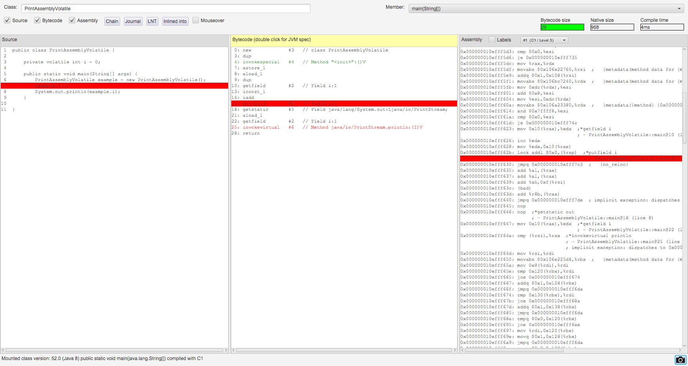

JITWatch
========

Log analyser and visualiser for the HotSpot JIT compiler.

* Video introduction to JITWatch [video](https://skillsmatter.com/skillscasts/5243-chris-newland-hotspot-profiling-with-jit-watch)
* Slides from my LJC lightning talk on JITWatch  [slides](http://www.chrisnewland.com/images/jitwatch/HotSpot_Profiling_Using_JITWatch.pdf)

<h3>For instructions and screenshots see the wiki</h3>
<h3>https://github.com/AdoptOpenJDK/jitwatch/wiki</h3>

The JITWatch user interface is built using JavaFX. This is included in the Oracle JDK. If you are using a JDK that does not include JavaFX (e.g. Azul Zulu, or some flavour of packaged OpenJDK on Linux) then you can download a pre-built OpenJFX jar from https://chriswhocodes.com and put it in your build classpath.

<h2>ant</h2>
<pre>ant clean compile test run</pre>

<h2>maven</h2>
<pre>mvn clean compile test exec:java</pre>

<h2>gradle</h2>
<pre>gradlew clean build run</pre>

<h2>Build an example HotSpot log</h2>
<pre># Build the code first with ant / maven / IDE
./makeDemoLogFile.sh</pre>

## volatile print assembly example

```
./makeVolatilePrintAssemblyLogFile.sh
```

will output volatile.log

## screenshot



